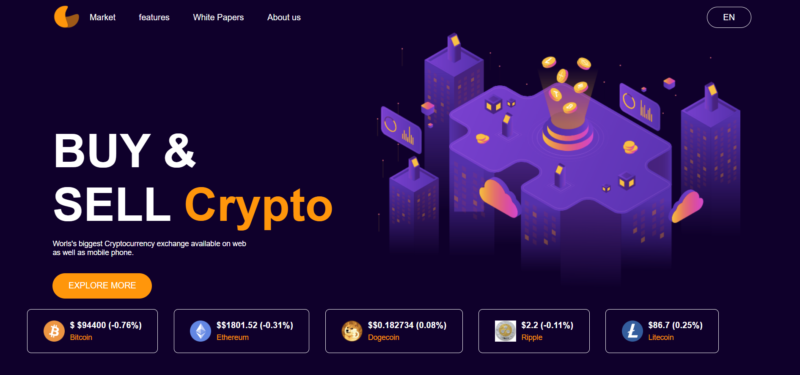

Cryptocurrency Price Tracker

🚀 Overview

This is a real-time Cryptocurrency Price Tracker built using HTML, CSS, and JavaScript, powered by the CoinGecko API. It provides live price updates for Bitcoin (BTC), Ethereum (ETH), and Dogecoin (DOGE) with real-time data analysis.

📌 Features

🔄 Live price updates for Bitcoin, Ethereum, and Dogecoin etc.

📊 Real-time data fetching using the CoinGecko API.

🎨 Responsive design for desktop & mobile users.

📈 Dynamic price changes displayed with color indicators (green for increase, red for decrease).

🕒 Automatic refresh every few seconds.

🛠️ Technologies Used

HTML – Structure of the web page.

CSS – Styling and responsiveness.

JavaScript – Fetching and displaying real-time data.

jQuery – Simplified AJAX requests and DOM manipulation.

CoinGecko API – Live cryptocurrency price data
🎯 Usage

Open the project in a web browser.

The latest cryptocurrency prices will be displayed.

The tracker updates automatically.
## 📷 Dashboard Preview

🔥 Future Enhancements

📉 Add historical price charts using Chart.js.

🌎 Support for multiple fiat currencies.

📡 Implement WebSockets for real-time updates.

🤝 Contributing

Contributions are welcome! Feel free to fork this repository and submit a pull request.
<!DOCTYPE html>
<html lang="en">
<head>
  <meta charset="UTF-8">
  <meta name="viewport" content="width=device-width, initial-scale=1.0">
  <title>PulseCrypto Alerts</title>
  <!-- Root style.css -->
  <link rel="stylesheet" href="/style.css">
  
</head>
<body>
  

    

      
      
      
      
      
    

    

      <h2>Welcome to PulseCrypto</h2>
      
Enter your email to continue

      <input type="email" id="login-email" placeholder="Your email..." />
      <button id="login-btn">Continue</button>
    

  

  

    <nav>
     
      <ul>
        <li><a href="/Explore/Explore.html">Explore more</a></li>
        <li><a href="/Features/features.html">Features</a></li>
        <li><a href="/AboutUs/AboutUs.html">About Us</a></li>
        <li><a href="/Market/Market.html">Market</a></li>
        <li><a href="/News/News.html">Live News</a></li>
      </ul>
    </nav>

  

    

    

      

        <button id="add-coin-btn" class="btn">+ Add Coin</button>
        

      

    

    

      <h1>PulseCrypto</h1>
      
Real-time cryptocurrency monitoring dashboard with alerts.

    

    

      

        
        

          <h3 id="bitcoin">$0</h3>
          
Bitcoin

          <input type="number" class="alert-input" placeholder="Target Price" />
          <button class="alert-btn">Set Alert</button>
          

        

      

      

        
        

          <h3 id="ethereum">$0</h3>
          
Ethereum

          <input type="number" class="alert-input" placeholder="Target Price" />
          <button class="alert-btn">Set Alert</button>
          

        

      

      

        
        

          <h3 id="dogecoin">$0</h3>
          
Dogecoin

          <input type="number" class="alert-input" placeholder="Target Price" />
          <button class="alert-btn">Set Alert</button>
          

        

      

      

        
        

          <h3 id="ripple">$0</h3>
          
Ripple

          <input type="number" class="alert-input" placeholder="Target Price" />
          <button class="alert-btn">Set Alert</button>
          

        

      

      

        
        

          <h3 id="litecoin">$0</h3>
          
Litecoin

          <input type="number" class="alert-input" placeholder="Target Price" />
          <button class="alert-btn">Set Alert</button>
          

        

      

    

  

  <!-- Root script.js -->
  
  
</body>
</html>
